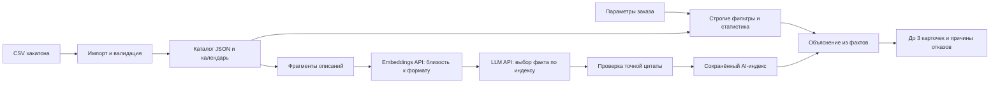

# Birge Explain — объяснимый подбор подрядчиков

Ядро рекомендаций для организаторов мероприятий в Казахстане. Принимает параметры заказа и возвращает до трёх подрядчиков с конкретным объяснением: стартовая цена и её разница с бюджетом, формат, языки, длительность и подтверждённая цитата из описания. Каждый тезис можно проверить по `evidence` в карточке.

Главная ценность — объяснение выбора. В проект включён адаптивный интерфейс на қазақша / русском / English, связанный с backend. Бронирования, заявки и уведомления подрядчикам не реализуются. Запуск и проверка интерфейса: [README_UI.md](README_UI.md).

## 1. Быстрый старт для жюри

Нужен **Node.js 22.13+**. Для запуска приложения внешние npm-зависимости не требуются. Для браузерных тестов используются dev-зависимости Playwright и axe (`npm ci`). Команды выполнять из корня репозитория.

```sh
node --version
node --test
node src/cli.js examples/request.json
node --env-file-if-exists=.env src/server.js
```

Сервер и интерфейс: **http://127.0.0.1:3000/**. Для работы через API в другом терминале:

```sh
curl -X POST http://127.0.0.1:3000/recommend -H "Content-Type: application/json" --data-binary @examples/request.json
```

В Windows PowerShell используйте `curl.exe`. Альтернативы: `npm start`, `npm test`, `npm run demo`; если PowerShell запрещает `npm.ps1`, используйте `npm.cmd` либо команды `node` выше.

Все ответы — **валидный JSON внутри `<response>...</response>`**, без Markdown. Содержимое тега разбирается через `JSON.parse`. Символы `<`, `>` и `&` внутри JSON-строк представлены Unicode escape-последовательностями, чтобы не ломать XML.

## 2. Что реализовано

- HTTP API и CLI; полный подбор и отдельный контракт для уже отфильтрованных кандидатов.
- Проверка города, категории, конкретной даты, бюджета, формата, опциональных языка и длительности.
- Площадки в общем каталоге и с тем же календарём, что ведущие или фотографы.
- До 3 карточек с 1–2 предложениями объяснения и проверяемыми исходными фактами.
- Три явных исхода: `matched`, `no_category_in_city`, `no_match`.
- При результате меньше трёх — `meta_explanation` с численными причинами и `rejection_stats`.
- Одинаковый запрос при неизменном каталоге, версии кода и AI-индексе даёт одинаковый ответ. Порядок: стартовая цена по возрастанию, затем `id` лексикографически. Перестановка записей каталога не влияет на выдачу.
- API-интеграции для LLM и эмбеддингов, проверка цитат, сохранение AI-индекса и режим без внешних API.
- Валидация, ограничение размера HTTP-запроса, тесты ядра, AI-адаптера и HTTP.

## 3. Как работает решение

1. Организатор передаёт город, дату, формат, категорию и бюджет в тенге; при необходимости язык и длительность в целых часах.
2. Сервис проверяет вход и покрытие календаря, исключает неподходящих подрядчиков и считает причины.
3. Выбираются до трёх прошедших записей в стабильном порядке.
4. Код рассчитывает факты совпадения и добавляет цитату, выбранную AI при подготовке каталога, либо консервативным правилом без индекса.
5. Возвращаются карточки и объяснение недостаточного количества вариантов.

Пример входа:

```json
{
  "city": "Алматы",
  "date": "2026-11-14",
  "event_format": "корпоратив",
  "category": "Ведущий",
  "budget": 1500000,
  "duration_hours": 4,
  "language": "русский"
}
```

Пример объяснения: «Цена от 700 000 ₸ — на 800 000 ₸ ниже бюджета 1 500 000 ₸; формат „корпоратив“ указан в каталоге; языки — русский; лимит 6 ч покрывает запрос на 4 ч». Разница со стартовой ценой не называется гарантированной экономией: итоговая стоимость неизвестна.

## 4. Архитектура и роль AI



AI-агент работает на этапе подготовки каталога. Эмбеддинги сопоставляют фрагменты описания с форматами мероприятий; пять наиболее релевантных фрагментов поступают LLM. Модель возвращает **только индекс существующего фрагмента или null**. Она не определяет занятость, цены или соответствие жёстким условиям и не пишет непроверяемый текст карточек.

Подготовка заранее выбрана ради детерминизма: набор форматов конечен, а генерация LLM при каждом запросе не гарантирует одинаковый ответ даже при низкой температуре. Результаты фиксируются в `ai-index.json`; сетевых запросов на пути выдачи нет. В заказе пока нет свободного пожелания, поэтому онлайн-эмбеддинг не нужен.

Индекс привязан SHA-256 к каждой нормализованной записи. Устаревшая или неподтверждённая цитата не используется. Неизвестный индекс, выдуманный текст, неверный JSON и повреждённые векторы отклоняются. `null` означает отсутствие пригодного факта: остаются структурированные признаки.

Без индекса цитата выбирается эвристически: приоритет у числовых деталей, оборудования и упоминания нужного формата; реклама и инструктивные фразы отсекаются. При отсутствии цитаты остаются структурированные факты. `explanation_source` показывает `ai_index`, `source_template` или `structured_facts`. Если объясняющие факты совпадают, сервис не придумывает различия и возвращает `explanation_limitations`.

| Компонент | Файл | Ответственность |
|---|---|---|
| Ядро | `src/engine.js` | Фильтры, причины, карточки, XML |
| Валидация | `src/validation.js` | Контракты, даты, типы, статистика |
| Данные | `src/storage.js` | Каталог, индекс, период календаря |
| AI-агент | `src/ai.js`, `src/prepare.js` | Эмбеддинги, выбор LLM, проверка, сохранение |
| HTTP / CLI | `src/server.js`, `src/cli.js` | Доступ к ядру |
| Импорт | `scripts/import-csv.js` | CSV с кавычками и переносами → JSON |
| Проверки | `test/` | Сценарии, каталог, подставной AI API, HTTP |

## 5. Технологии и подключение моделей

JavaScript ESM, Node.js, встроенные `node:http`, `node:crypto`, `node:test`, `fetch`. Для 66 профилей отдельная БД и векторный сервер не нужны. Косинусная близость рассчитывается при подготовке; векторы после выбора цитат не сохраняются.

Поддерживается OpenAI-совместимый REST-контракт: `POST /embeddings` и `POST /chat/completions` с `response_format: {"type":"json_object"}`. LLM и эмбеддинги могут быть у разных провайдеров. Форматы API сверены с официальной документацией: [эмбеддинги](https://developers.openai.com/api/docs/guides/embeddings), [Chat Completions](https://developers.openai.com/api/reference/resources/chat).

Названия моделей настраиваются в `.env`. Проверенная конфигурация: **OpenAI `gpt-4.1-mini` + `text-embedding-3-small`**, базовый URL обоих API — `https://api.openai.com/v1`. Реальная сквозная проверка эмбеддингов, выбора LLM и построения карточки прошла. В `LLM_API_KEY` и `EMBEDDING_API_KEY` можно указать один ключ OpenAI с доступом к обеим моделям; ключи не входят в репозиторий. Режим без ключей доступен с готовым индексом или со структурированными объяснениями.

1. Скопируйте `.env.example` в `.env`: `Copy-Item .env.example .env` в PowerShell или `cp .env.example .env` в bash.
2. Заполните `LLM_BASE_URL`, `LLM_API_KEY`, `LLM_MODEL`, `EMBEDDING_BASE_URL`, `EMBEDDING_API_KEY`, `EMBEDDING_MODEL`. Базовые URL должны включать `/v1`, если этого требует провайдер. `.env` исключён из Git.
3. Подготовьте индекс и запустите сервер:

```sh
node --env-file=.env src/prepare.js
node --env-file=.env src/server.js
```

Подготовка передаёт внешним API форматы и фрагменты описаний. Календарь и параметры клиентских заказов в prompts не передаются. При первом запуске: до одного embeddings-запроса на профиль и одного LLM-запроса на каждый его формат, без учёта повторов при временных ошибках. Вызовы оплачиваются по тарифам провайдера. Повторный запуск переиспользует подтверждённые решения для неизменённых записей и тех же моделей. Если допустимых фрагментов нет, для каждого формата сохраняется явный `null` без вызова модели: выдуманные факты не добавляются.

Таймаут `AI_TIMEOUT_MS` по умолчанию 20 секунд. `AI_MAX_RETRIES=2` разрешает два повтора сетевых ошибок, таймаутов, HTTP 429 и временных 5xx; HTTP 401/410 не повторяются. После каждого профиля прогресс сохраняется в `data/ai-index.json.checkpoint.json`. Повтор команды продолжает работу, используя сохранённые решения. Основной индекс атомарно заменяется только после успешной проверки всего каталога. Временные блокировки файлов Windows/OneDrive обрабатываются ограниченными повторами записи. Сервер читает индекс при запуске; после обновления нужен перезапуск. Для принудительной полной генерации задайте новый `AI_INDEX_PATH`. Новая генерация может выбрать другие цитаты: детерминизм гарантируется для зафиксированного индекса.

## 6. API и контракты

| Метод | Путь | Назначение |
|---|---|---|
| GET | `/health` | Число профилей, период календаря, наличие и полнота индекса (`ai.ready`) |
| GET | `/catalog/options` | Допустимые города, категории, форматы и языки |
| POST | `/recommend` | Полный подбор, вход `application/json` |
| POST | `/explain` | Запрос + статистика + доступные подрядчики |

`/recommend` принимает объект из примера выше. Пять первых полей обязательны; `duration_hours` и `language` можно пропустить или передать `null`. Бюджет — неотрицательное целое, длительность — положительное целое. Даты — существующие календарные даты без времени. Сравнения строк игнорируют регистр и лишние пробелы; синонимы вроде «зал» → «Банкетный зал» не угадываются. Используйте справочник.

`/explain` принимает JSON с полями `client_request`, `rejection_stats`, `available_contractors` или три последовательных тега с JSON внутри, как в [examples/prefiltered.xml](examples/prefiltered.xml). Это доверенная граница: без календаря в исходном контракте сервис не может самостоятельно подтвердить дату; её проверяет вызывающий сервис. Ответ содержит `availability_source: "upstream_prefiltered"`. Если записи содержат `busy_dates`, дата проверяется дополнительно. Кандидат, нарушающий условия, даёт HTTP 400.

```sh
curl -X POST http://127.0.0.1:3000/explain -H "Content-Type: application/xml" --data-binary @examples/prefiltered.xml
```

| Поле ответа | Значение |
|---|---|
| `status` | `matched` / `no_category_in_city` / `no_match` |
| `cards` | 0–3 карточки: `id`, `name`, `category`, `city`, `price_from_kzt`, `explanation`, `evidence`, `explanation_source`, `ai_index_applied`, `data_flags`, `price_note` |
| `eligible_count` | Число прошедших кандидатов до ограничения тремя |
| `meta_explanation` | Причина результата меньше трёх, иначе `null` |
| `rejection_stats` | Численность города и причины исключения |
| `availability_source` | `catalog_calendar` или `upstream_prefiltered` |
| `explanation_limitations` | Замечания о совпадающих объясняющих фактах |
| `data_version` | SHA-256 использованных кандидатов, статистики и индекса |

Причины **не пересекаются**: подрядчик учитывается по первому неуспешному условию в порядке категория → дата → бюджет → формат → язык → длительность. Сумма исключённых плюс число прошедших равна `total_in_city`. Занятый и дорогой подрядчик учитывается только как занятый: это не независимые счётчики всех нарушений.

К четырём причинам исходного задания добавлены `wrong_language_count`, `insufficient_duration_count`, `unknown_duration_count`; во входе `/explain` дополнительные поля необязательны и по умолчанию равны нулю. Статистика должна охватывать весь переданный пул: нельзя скрыть часть прошедших кандидатов, оставив прежнее `total_in_city`.

HTTP-ошибки также обёрнуты в `<response>` и содержат `error.code`, `error.message`: 400 — неверный ввод/дата вне календаря; 404 — маршрут; 405 — метод; 413 — тело больше 1 MB; 415 — тип содержимого; 500 — внутренняя ошибка. Отсутствие кандидатов — HTTP 200 с явным `status`.

## 7. Данные и интеграции

Источник — предоставленный HTML-предпросмотр и соответствующий `hackathon dataset anonymized .csv`, найденный рядом с ним. HTML содержит укороченные описания и агрегаты занятости; рабочий каталог импортирован **из CSV с полными описаниями и конкретными датами**. Скрипты из HTML не исполнялись.

Включён [data/contractors.json](data/contractors.json): **66 профилей**, Алматы, Астана и «Зарубежье», 17 категорий. Календарь: **2026-09-23 — 2026-12-31 включительно**. `busy_dates` обязателен. Внутри периода отсутствие даты в этом массиве означает доступность по датасету. За пределами периода `/recommend` возвращает ошибку, не рекомендацию.

Сохранены `price_imputed`, `city_imputed`, `synthetic`: часть цен/городов заполнена при подготовке набора, часть профилей синтетическая. Флаги видны в карточках. Стартовая цена не содержит тариф за час/гостя, поэтому не умножается на длительность и не становится итоговой сметой. `max_hours = null` означает, что длительность нельзя подтвердить; если она задана в заказе, запись исключается с отдельной причиной.

Повторный импорт:

```sh
node scripts/import-csv.js "C:/path/hackathon dataset anonymized .csv" data/contractors.json 2026-09-23 2026-12-31
```

Диапазон берётся из условий набора, не из первой и последней занятых дат. Описания нормализуются по пробелам и не дополняются. Для другого набора задайте реальный период; после импорта пересоздайте AI-индекс и перезапустите сервер.

## 8. Как проверить решение

```sh
node --test
node src/cli.js examples/request.json
node src/cli.js examples/one-match.json
node src/cli.js examples/no-category.json
node src/cli.js examples/no-match.json
node src/cli.js examples/venue.json
node src/cli.js examples/prefiltered.xml
```

| Сценарий | Ожидаемый результат |
|---|---|
| `request.json`: ведущий, Алматы, 14 ноября, 1 500 000 ₸ | `matched`: HK-44923, HK-29829, HK-27222; всего подходят 4 |
| `one-match.json`: флорист, Астана | `matched`, одна карточка HK-90002 и объяснение |
| `no-category.json`: национальный ансамбль, Астана | `no_category_in_city`, пустой массив |
| `no-match.json`: ведущий, Алматы, бюджет 1 ₸ | `no_match`: 5 заняты, 5 выше бюджета; ещё 40 записей другой категории |
| `venue.json`: зал, Астана, 14 ноября | `no_match`: единственная площадка этой категории занята |
| Тот же зал, дата `2026-11-15` | `matched`, HK-90012; флаги синтетического профиля и заполненной цены |
| Дата `2027-01-01` | Ошибка: нет покрытия календаря |

Тесты проверяют детерминизм при перестановке каталога, все причины отказов, занятые площадки, границы бюджета и календаря, отсутствие длительности, статистику, цитаты, устаревший индекс, возобновление подготовки, сетевые ошибки и реальные HTTP-запросы. `node --test` использует подставной AI-транспорт и не расходует квоты.

Дополнительные воспроизводимые проверки:

```sh
node --env-file=.env scripts/verify-ai.js
node --env-file=.env scripts/audit.js
```

Первая делает **реальные** вызовы OpenAI для одного профиля (эмбеддинги → LLM → проверенная цитата → карточка); расходует API-квоту. Вторая без сети проверяет все 100 дней календаря, 112 сочетаний города/категории/формата и граничные запросы. В `scripts/audit.js` можно передать путь к исходному CSV для сверки всех записей. Результат последней проверки: **11 398 запросов, 12 549 карточек; все проверки прошли**. Отчёт — [reports/audit.json](reports/audit.json).

Полный индекс содержит **193 решения для 66 профилей**, из них 112 — цитаты, остальные — явное отсутствие пригодной цитаты. `ai_index_applied=true` означает использование сохранённого решения конвейера, включая `null`; это не утверждение, что LLM нашла факт для каждой записи. `explanation_source=ai_index` означает, что в карточке действительно использована выбранная моделью цитата. `/health` должен показывать `ai.ready=true`, а не только `ai_index_loaded=true`.

## 9. Ограничения

- Нет бронирований, оплаты, заявок, уведомлений и личного кабинета. Интерфейс подбора реализован; серверные объяснения сохраняются на исходном русском языке при переключении языка интерфейса.
- Каталог и календарь — снимок; внешняя синхронизация расписаний не реализована. Точность зависит от исходных записей.
- Строгие фильтры не выводят язык, формат или длительность из рекламного текста. Заказ задаётся структурированно; разбор фразы «подобрать зал на 14 ноября» пока не реализован.
- Цитата подтверждает наличие утверждения в датасете, но не его истинность в реальном мире. Фильтр рекламы эвристический; для производства нужен аудит фактов и оценка на размеченных примерах.
- При одинаковых фактах уникальность объяснения объективно недостижима; это явно обозначается.
- Сортировка простая и стабильная; AI улучшает обоснование, а не подменяет жёсткие фильтры.
- Нет авторизации, rate limiting, БД и административного интерфейса. По умолчанию сервер слушает localhost. `/explain` предназначен для доверенного сервиса.
- OpenAI проверен реальными вызовами; при смене провайдера/модели используйте `npm run ai:verify`. Совместимость зависит от JSON-режима и доступов аккаунта.

## 10. Deployed-версия

Пока отсутствует. Решение запускается локально командами выше; публикация не выполнялась.
# BirgeMakers
